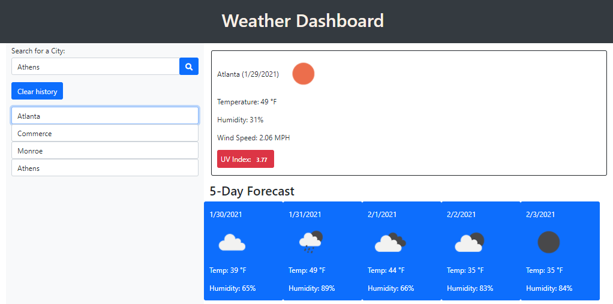

# WeatherDashboard
06 Server-Side APIs: Weather Dashboard homework assignment

## Contact information and Deployment
Created by: Tori Sanford
Date: 01/29/2021
Contact: Tori.danielle.clark91@gmail.com
Link to deployed project:  https://tsanfordgatech.github.io/WeatherDashboard/
Screen shot of completed assignment:  

## About this Project: 
This project is my server-side APIs homework assignment. I will use third-party APIs to create a weather dashboard. 

## What I learned from this project: 
- More experiance with controlling format with JS
- Got better at locating resources for methods
- calling in API's with DOM manipulation

## User Story

User Story
AS A traveler
I WANT to see the weather outlook for multiple cities
SO THAT I can plan a trip accordingly

## Acceptance Criteria

GIVEN a weather dashboard with form inputs
WHEN I search for a city
THEN I am presented with current and future conditions for that city and that city is added to the search history
WHEN I view current weather conditions for that city
THEN I am presented with the city name, the date, an icon representation of weather conditions, the temperature, the humidity, the wind speed, and the UV index
WHEN I view the UV index
THEN I am presented with a color that indicates whether the conditions are favorable, moderate, or severe
WHEN I view future weather conditions for that city
THEN I am presented with a 5-day forecast that displays the date, an icon representation of weather conditions, the temperature, and the humidity
WHEN I click on a city in the search history
THEN I am again presented with current and future conditions for that city
WHEN I open the weather dashboard
THEN I am presented with the last searched city forecast

## You are required to submit the following for review:

The URL of the deployed application.
The URL of the GitHub repository. Give the repository a unique name and include a README describing the project.